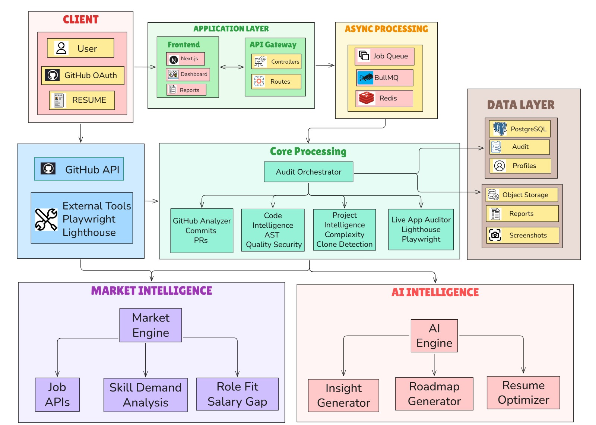

  <h1>DevCareer Intelligence Platform</h1>

  

    <strong>The Automated Technical Assessment Authority: Precision codebase auditing and verified skill-tier identification for modern engineering teams.</strong>
  

  

    <b>Enterprise Engine</b> | <b>v1.0.0-Stable</b> | <b>MIT License</b>
  

  

    <a href="#-1-the-vision--the-philosophy-of-verification">Philosophy</a> •
    <a href="#-2-system-features">Features</a> •
    <a href="#-3-engineering-architecture">Architecture</a> •
    <a href="#-4-technical-stack">Stack</a> •
    <a href="#-5-database-schema">Database</a> •
    <a href="#-6-installation--setup">Setup</a> •
    <a href="#-7-security--privacy">Security</a>
  

---

## 📌 1. The Vision & Philosophy of Verification

DevCareer Intelligence is a developer-first auditing platform designed to solve the critical problem of technical talent verification in an era of generative AI and tutorial-clone saturation. 

Our mission is to replace subjective resume-scanning with **empirical codebase auditing**, ensuring that engineering managers make evidence-based hiring decisions.

### Solving Key Industry Friction
- **Candidate Quality Variance:** Automated systems currently fail to distinguish between genuinely skilled architects and those utilizing high-level boilerplate generators.
- **Recruitment Latency:** Initial technical screenings typically consume 5-10 hours of senior engineering time per candidate. Our platform automates the first 80% of this audit.
- **Credential Integrity:** We prioritize physical Git evidence over static certifications, verifying claims at the file and commit level.

---

## 🚀 2. System Features

### 2.1 Deep Codebase Auditing
Utilizing large-context-window inference and AST chunking, the platform performs multi-dimensional audits:
- **Architectural Patterns:** IdentifiesMVC, Clean Architecture, Dependency Injection, and Microservices patterns.
- **Security Posture:** Detects hardcoded secrets, SQL injection vectors, and broken authentication logic at source.
- **Code Quality Metrics:** Evaluates modularity, error recovery, and documentation quality.

### 2.2 The "Resume Verification" Engine
A synthesis engine that cross-references candidate claims against physical repository metadata.
- **Discrepancy Detection:** Flags claims that lack supporting evidence in the provided repositories.
- **Technical Re-Writing:** Generates evidence-grounded bullet points ready for inclusion in professional hiring profiles.

### 2.3 Tutorial-Clone Detection
Our proprietary **Heuristic Signature Engine** identifies repository structures indicative of popular tutorials or cloned boilerplate.
- **Commit History Density:** Analyzes commit intervals to distinguish between long-term development and bulk "drop-and-push" uploads.
- **Structural Signatures:** Matches file trees against known common boilerplate distributions.

### 2.4 90-Day Skill Trajectory
Provides a data-driven learning roadmap based on the delta between a candidate's verified skills and the target role's technical benchmarks.

---

## 🏗️ 3. Engineering Architecture & Multi-Agent Orchestration

The platform utilizes an asynchronous, stage-managed pipeline designed for heavy inference loads and long-horizon tasks.

  

### Multi-Phase Pipeline (BullMQ)
1. **Source Retrieval Stage:** Clones repositories into isolated temporary storage and filters for relevant source files.
2. **Heuristic Analysis Stage:** Performs semantic chunking and executes high-speed LLM audits via Groq.
3. **Synthesis Stage:** Fuses audit findings with resume input to generate the final verified profile.
4. **Market Alignment Stage:** Queries external registries to match candidates with high-relevancy vacancies.

---

## 🛠️ 4. Technical Stack

| Layer | Technology |
|-------|------------|
| **Core** | Next.js 14 (App Router) |
| **Styling** | Tailwind CSS |
| **Database** | Supabase (PostgreSQL) |
| **Queue** | BullMQ & Redis |
| **Inference** | Groq (Llama series) / Google Gemini |

---

## 📊 5. Database Schema

The system uses a highly normalized PostgreSQL schema designed for high-concurrency auditing and relational integrity.

- **`audit_sessions`**: Primary transaction controller.
- **`repo_analyses`**: Granular per-repository analytic output.
- **`skill_profiles`**: Aggregated multidimensional skill maps.
- **`roadmaps`**: Actionable learning prescriptive data.

---

## 🏁 6. Installation & Setup

For a full implementation guide, see the **[Setup Documentation](frontend/docs/setup.md)**.

### Quick Start
1. `cd frontend && npm install`
2. Configure environment variables for Groq, Gemini, and Supabase.
3. Run `npm run dev` to boot both the server and worker orchestration processes.

---

## 🔒 7. Security & Privacy

DevCareer Intelligence implements strict data isolation:
- **Stateless Workers:** Source code is never persisted. All ephemeral data is wiped immediately after abstract findings are extracted.
- **Isolated Audits:** Unique UUID-based contexts prevent cross-contamination of findings.
- **Row Level Security (RLS):** Policies ensure that sensitive audit data is only accessible to authorized callers.

---

## 🤝 8. Contributing

We maintain a rigorous standard for contributions. If you are enhancing detection heuristics or adding market adapters, please ensure appropriate unit test coverage.

1. Fork the repository.
2. Create a feature branch.
3. Commit your changes.
4. Open a merge request against the main branch.

---

  <i>"Verifying engineering reality." — DevCareer Intelligence</i>

